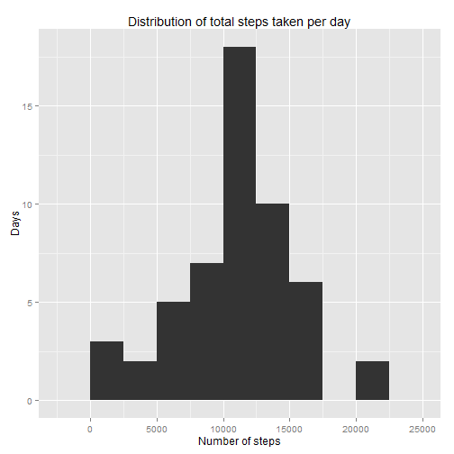

## Loading libraries

```r
library(dplyr)
library(ggplot2)
```

## Loading the data
(activity.zip source file must be in working directory)


```r
unzip("activity.zip")
activity <- read.csv("activity.csv")
```

## What is mean total number of steps taken per day?


```r
analyzeactivity <- function(activity)
{
    totalsteps <- group_by(activity,date) %>% summarize(sum = sum(steps))
    print(qplot(sum, data = totalsteps, geom = "histogram", binwidth=2500,
                main = "Distribution of total steps taken per day", 
                xlab = "Number of steps", ylab = "Days"))
    print(paste("Mean steps per day:", mean(totalsteps$sum)))
    print(paste("Median steps per day:", median(totalsteps$sum)))
}

activityclean <- activity[!is.na(activity$steps),]
analyzeactivity(activityclean)
```

 

```
## [1] "Mean steps per day: 10766.1886792453"
## [1] "Median steps per day: 10765"
```

## What is the average daily activity pattern?


```r
stepsbyint <- group_by(activityclean,interval) %>% summarize(mean = mean(steps))

plotsteps <- function(summary)
{
    g <- ggplot(summary, aes(interval, mean)) +
        labs(title = "Mean steps taken per 5-minute interval", 
                  x = "Interval", y = "Steps")
    ifelse (length(summary$timeofweek), g <- g + facet_wrap(~timeofweek), 0)
    print(g + geom_line())
}

plotsteps(stepsbyint)
```

 

```r
amax <- filter(stepsbyint, mean == max(mean))
paste("The", amax[1,1], "interval contains the maximum average number of steps.")
```

```
## [1] "The 835 interval contains the maximum average number of steps."
```

## Imputing missing values
Missing values are imputed using the daily mean for each interval, rounded to the nearest whole step.


```r
activity <- mutate(activity, NAval = is.na(steps))
summary <- group_by(activity,date) %>% 
    summarize(NAs = sum(NAval)) %>% 
    filter(NAs > 0)

numdays <- length(summary$date)
missingvalues <- sum(summary$NAs)

paste ("There are a total of", missingvalues, "missing values occurring on", 
       numdays, "days, for an average of", missingvalues / numdays / 288 * 100,
       "percent of values missing per day where there are missing values.")
```

```
## [1] "There are a total of 2304 missing values occurring on 8 days, for an average of 100 percent of values missing per day where there are missing values."
```

```r
awithmeans <- left_join(activity, stepsbyint, by = "interval")
awithmeans$steps[is.na(awithmeans$steps)] <- 0
awithmeans <- mutate (awithmeans, steps = round(mean) * NAval + steps * !NAval)

##new dataset with mean values filled in
newactivity <- awithmeans[,1:3]
analyzeactivity(newactivity)
```

 

```
## [1] "Mean steps per day: 10765.6393442623"
## [1] "Median steps per day: 10762"
```

## Are there differences in activity patterns between weekdays and weekends?


```r
newactivity <- mutate(newactivity, day = weekdays(as.POSIXlt(date)))
newactivity$timeofweek <- as.factor(
    ifelse(newactivity$day %in% c("Saturday","Sunday"), "weekend", "weekday")) 

newactivity <- group_by(newactivity, timeofweek, interval)
summary <- summarize(newactivity,mean = mean(steps))

plotsteps(summary)
```

 
